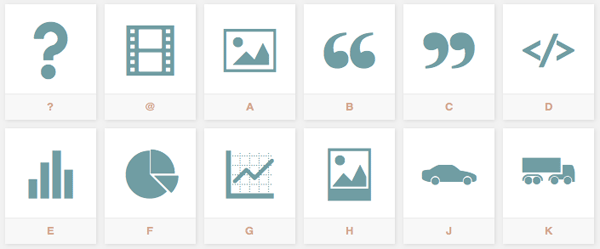



说明：原文为【[Why And How To Use Icon Fonts](http://www.vanseodesign.com/web-design/icon-fonts/)】, 此文是译文！

我们都知道，图片有诸多优点，但是目前在网站设计这行业面临各种各样的挑战。图片不但体积大，增大了总文件的体积大小，还增加了很多额外的"http请求"，这都会大大降低网页的性能的。图片有一个缺点就是不能很好的进行“缩放”，因此，有时候在“响应式设计”中需要使用图像的最好解决方案就是不去使用图片。

上一周我提出一个关于“在‘响应式设计’中的图像的关键问题是什么”的概述，尤其是：如何为各种尺寸的设备提供相适应的的图片？而今天我是时候该认真考虑一下“字符图标”，并且我们可以在我们的网页中使用“字符图标”去代替一些图片，也可以达到一样的效果。

<!--break-->

# 字符图标的好处
位图图片不能很好地进行缩放，当图片进行放大时会失真（即变模糊），当图片进行缩小时就会浪费掉像素。而且加载每一张图片都需要一次的“http请求”，因此也拖慢了整体加载页面的时间。另外，要是没有图片编辑器（软件）的话就很难对图片进行编辑、处理等操作。
字体就不会有以上这些问题，字体可以进行随意的缩放并且对每一个字符都不需要进行额外的“http请求”。当我们把字体当成文字那样用来写作与交流的时候，往往没有想到的是，它们只是[形状](http://www.vanseodesign.com/web-design/form-surface-volume/)。如果用图标来取代这些字母形状，将又会是怎样呢？

“[‘字符图标’是非常美妙、神奇的](http://css-tricks.com/examples/IconFont/)”， Chris Coyier这样说。他制作关于“字符图标”的Demo页面就列出6大理由，为什么“字符图标”是如此美妙与神奇？

 + 很容易地缩放；

 + 很容易地改变颜色；

 + 很容易地产生阴影；

 + 可以拥有透明效果；

 + 一般来说，有更加先进的浏览器支持；

 + 可以[使用CSS来装饰](http://www.vanseodesign.com/css/thoughts-on-building-a-typographic-stylesheet/)（可以得到CSS很好支持）；

 + 可以快速转化形态（做出一些变化，如 :hover等）；

 + 可以做出跟图片一样可以做的事情（改变透明度、旋转度，等）；

 + 本身体积更小，但携带的信息并没有削减。

# 如何使用字符图标？

